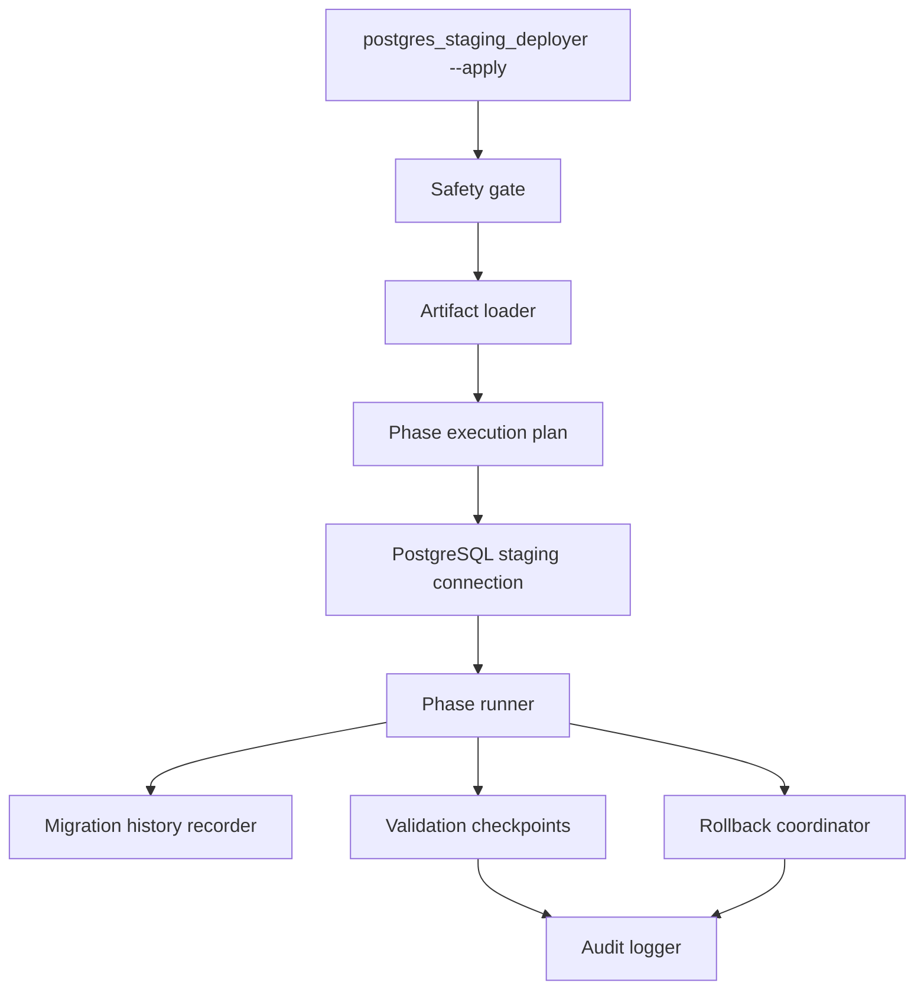
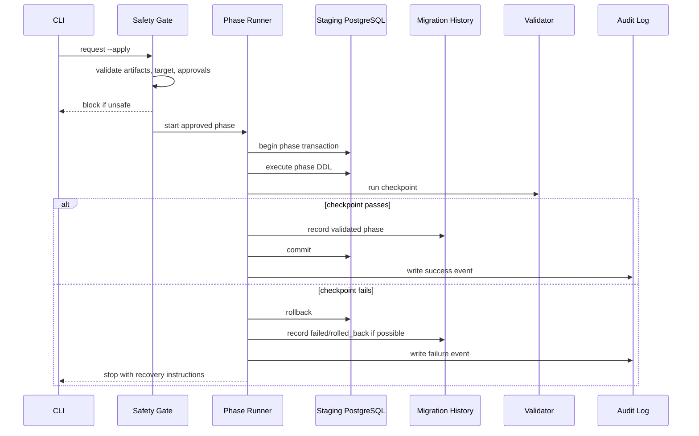

# PostgreSQL Deployment Executor Design

Phase: 5B.14A

Read-only design phase. This document defines the future PostgreSQL staging deployment executor architecture. No SQL execution, Supabase connection, schema deployment, runtime enablement, or data migration is included.

## Executive Summary

The executor should convert the existing offline artifacts into a controlled staging-only deployment flow. It should sit behind the existing `postgres_staging_deployer.py --apply` guard, and that guard must remain blocked until implementation, review, and staging approval are complete.

Current prerequisites from earlier phases:

- Generated schema draft: `reports/postgres_generated_schema.sql`
- Generated schema summary: `reports/postgres_generated_schema_summary.md`
- Schema validation report: `reports/postgres_schema_validation_report.md`
- Deployment dry-run plan: `reports/postgres_deployment_dry_run_plan.md`
- Staging deployment skeleton: `postgres_staging_deployer.py`
- Post-deployment validation plan: `reports/postgres_postdeploy_validation_plan.md`

The executor implementation has not started. PostgreSQL runtime cutover remains NO-GO.

## 1. Executor Architecture

Recommended components:

- CLI entrypoint: extend `postgres_staging_deployer.py` only after a future implementation phase explicitly approves execution.
- Artifact loader: reads generated SQL, validation reports, dry-run plan, and seed manifests.
- Safety gate: validates environment, explicit staging target, runtime-disabled state, and approval flags before any connection is opened.
- Connection adapter: future PostgreSQL-only adapter, isolated from SQLite runtime paths.
- Phase runner: executes deployment phases in deterministic order.
- Migration recorder: writes phase status to PostgreSQL migration metadata.
- Validation runner: executes post-deployment checks after each checkpoint.
- Rollback coordinator: decides whether to transaction-rollback, drop staging schema objects, or stop for manual recovery.
- Audit logger: writes structured logs with redacted secrets and artifact hashes.

The executor must not call SQLite schema bootstrap functions. It must not relax the PostgreSQL startup gate.

## 2. Deployment Phase Execution Model

The executor should use the 5B.13G dry-run phase order and treat each phase as an explicit unit of work:

| Phase | Scope | Primary rollback point |
|---|---|---|
| 1 | Migration history tables and system metadata | Transaction rollback or drop metadata tables in staging |
| 2 | Companies, branches, users, branch catalogs, subscriptions | Transaction rollback before seed data |
| 3 | Chart of accounts, customers, suppliers, banks, counterparties | Transaction rollback before dependent documents |
| 4 | Inventory, inventory import batches, stock movements, purchase orders | Transaction rollback before document/POS phases |
| 5 | Invoices, bills, payments, allocations, vouchers, recurring documents | Transaction rollback before journals |
| 6 | Journal entries, journal lines, accounting periods | Transaction rollback before POS/payroll |
| 7 | POS sales, lines, returns, suspended sales, cashier closings | Transaction rollback before audit/system phase |
| 8 | Payroll, payroll records, fixed assets | Transaction rollback before audit/system phase |
| 9 | Audit logs, system logs, migration logs, maintenance settings | Final validation checkpoint |

Execution model:

1. Load and hash deployment artifacts.
2. Confirm dry-run and schema validation reports are current.
3. Confirm future explicit apply approval.
4. Open staging PostgreSQL connection only after safety gate passes.
5. Execute one phase at a time.
6. Validate the phase.
7. Record phase status in migration history.
8. Continue only if validation passes.
9. Stop before runtime enablement.

## 3. Transaction Strategy

Preferred strategy:

- Use one transaction per deployment phase.
- Create base tables before indexes and optional constraints where ordering is complex.
- Add foreign keys in the same phase when parent tables already exist.
- Defer high-risk or cyclic constraints to an explicit FK constraint sub-step.
- Commit only after the phase validation checkpoint passes.

Implementation notes:

- PostgreSQL DDL is transactional for normal table, constraint, and index creation.
- Avoid `CREATE INDEX CONCURRENTLY` in the first executor because it cannot run inside a transaction block.
- If concurrent indexes are later needed, split them into a separate non-transactional phase with explicit rollback instructions.
- Never mix seed data, schema DDL, and runtime activation in one transaction.

## 4. Rollback Strategy

Rollback should be stage-aware:

- Pre-connection failure: do not change anything; report missing configuration/artifacts.
- In-phase DDL failure before commit: rollback current transaction.
- Validation failure before phase commit: rollback current transaction.
- Validation failure after commit: stop, mark phase failed in migration history if possible, and require manual recovery.
- Staging-only full reset: drop the disposable staging schema or database if approved.

Rollback points:

- Before opening a staging connection.
- Before each phase transaction starts.
- Before each phase commit.
- Before each seed deployment group.
- Before runtime activation.
- Before cutover approval.

Do not mutate production SQLite data during PostgreSQL rollback.

## 5. Migration History Model

Future PostgreSQL migration history should be separate from SQLite migration metadata and include enough data to audit staging deployments.

Suggested table: `postgres_deployment_history`

Suggested fields:

- `deployment_id` text primary key
- `phase_id` text not null
- `phase_name` text not null
- `status` text not null
- `artifact_sha256` text not null
- `started_at` timestamptz not null
- `finished_at` timestamptz
- `executor_version` text not null
- `database_url_label` text not null
- `error_summary` text
- `validation_summary` text
- `created_by` text

Allowed statuses:

- `planned`
- `running`
- `validated`
- `committed`
- `failed`
- `rolled_back`
- `blocked`

## 6. Validation Checkpoints

Use the 5B.13I framework as the checkpoint model:

- Schema validation: table count, object existence, primary keys.
- Table validation: all expected tables exist.
- Column validation: required columns, types, nullability, defaults.
- Index validation: all expected indexes exist after placeholders are replaced.
- FK validation: all expected FK constraints exist and point to expected parents.
- Seed data validation: required seed rows exist.
- Migration history validation: each phase is recorded with status and artifact hash.
- Runtime readiness validation: startup gate remains safe until all checks pass.

Checkpoint placement:

1. Before phase 1: artifact and environment validation.
2. After each schema phase: table/PK/FK/index checks for that phase.
3. After seed deployment: seed table row checks.
4. Before runtime enablement: full schema and data readiness checks.
5. Before cutover: application smoke test readiness checks.

## 7. Failure Recovery Flow

Failure recovery rules:

- Stop on first failure.
- Do not proceed to later phases after a failed checkpoint.
- Preserve logs and artifact hashes.
- Prefer transaction rollback over object-by-object cleanup.
- Require manual approval before retrying a failed phase.

## 8. Dry-Run Vs Apply Behavior

Dry-run behavior:

- Default mode.
- Loads artifacts.
- Shows phase order and risks.
- Shows redacted database URL diagnostics if present.
- Does not open a database connection.
- Does not execute SQL.
- Produces no migration history rows.

Apply behavior, future implementation:

- Must require explicit `--apply`.
- Must require a staging-only confirmation flag.
- Must reject production-looking targets.
- Must verify `ERP_ENABLE_POSTGRES_RUNTIME` is not enabling application runtime prematurely.
- Must open a PostgreSQL connection only after all safety gates pass.
- Must execute only reviewed, versioned artifacts.
- Must stop before runtime cutover.

Current 5B.14A status: apply behavior remains design-only and unimplemented.

## 9. Logging Model

Logging should be structured and redact secrets.

Required events:

- Artifact load started/completed.
- Artifact hash summary.
- Safety gate decision.
- Staging target label, redacted.
- Phase started.
- Phase validation passed/failed.
- Phase committed/rolled back.
- Migration history write status.
- Executor stop reason.

Never log:

- Raw `DATABASE_URL`
- Passwords or tokens
- Full Supabase credentials
- Raw seed payloads containing secrets

## 10. Safety Protections

Required protections before implementation:

- Default mode remains dry-run.
- `--apply` remains blocked until the executor is implemented in a future phase.
- Staging-only target confirmation is mandatory.
- Raw `DATABASE_URL` must never be printed.
- Production SQLite data must not be read or mutated by the PostgreSQL executor.
- PostgreSQL runtime flag must remain disabled until post-deployment validation passes.
- Generated SQL must be reviewed and index placeholders replaced before execution.
- Migration history must record every phase.
- Runtime cutover remains a separate approval after schema, seeds, data migration, and smoke tests.

## Cutover Safeguards

Cutover must remain blocked until:

- PostgreSQL schema deployer exists and passes staging execution tests.
- Post-deployment validation framework has real PostgreSQL query implementations.
- Seed deployment is implemented and validated.
- Data migration is implemented and reconciled.
- Application SQL portability blockers are resolved.
- Runtime startup gate is updated to recognize validated PostgreSQL schema readiness.
- Rollback and production SQLite preservation plan are approved.

## Recommended Next Phase

Phase 5B.14B should implement the executor as a still-blocked skeleton extension only, or first replace generated index placeholders with reviewed PostgreSQL index definitions. Actual SQL execution should wait until artifacts, indexes, seed manifests, and validation query definitions are ready.
