# PostgreSQL Schema Dependency Graph

Phase: 5B.14M

This graph is derived from `reports/postgres_generated_schema.sql`. It is an offline analysis artifact only; no SQL was executed.

## Summary

- Table nodes: **51**
- Foreign-key edges: **47**
- Executable index nodes: **0**
- Commented index placeholders: **67**
- `ALTER TABLE` statements: **0**
- Seed statements: **0**

## Dependency-Safe Table Order

| Order | Table | Current statement | References |
|---:|---|---:|---|
| 1 | `accounting_periods` | 2 | - |
| 2 | `accounts_payable` | 3 | - |
| 3 | `branch_type_catalog` | 9 | - |
| 4 | `companies` | 14 | - |
| 5 | `customers` | 18 | - |
| 6 | `database_identity` | 19 | - |
| 7 | `journal_entries` | 25 | - |
| 8 | `license_payment_transactions` | 27 | - |
| 9 | `maintenance_settings` | 28 | - |
| 10 | `migration_history` | 29 | - |
| 11 | `migration_logs` | 30 | - |
| 12 | `payments` | 32 | - |
| 13 | `payroll_records` | 34 | - |
| 14 | `schema_version` | 43 | - |
| 15 | `subscription_plan_settings` | 45 | - |
| 16 | `suppliers` | 47 | - |
| 17 | `system_logs` | 48 | - |
| 18 | `system_settings` | 49 | - |
| 19 | `transactions` | 50 | - |
| 20 | `audit_logs` | 4 | `companies` |
| 21 | `bills` | 7 | `suppliers` |
| 22 | `branch_type_module_defaults` | 10 | `branch_type_catalog` |
| 23 | `branches` | 11 | `companies` |
| 24 | `cashier_closings` | 12 | `companies` |
| 25 | `chart_of_accounts` | 13 | `companies` |
| 26 | `company_subscriptions` | 15 | `companies` |
| 27 | `counterparties` | 16 | `companies` |
| 28 | `fixed_assets` | 20 | `companies` |
| 29 | `inventory` | 21 | `companies` |
| 30 | `inventory_import_batches` | 22 | `companies` |
| 31 | `invoices` | 24 | `customers` |
| 32 | `payroll` | 33 | `companies` |
| 33 | `pending_approvals` | 35 | `companies` |
| 34 | `pos_returns` | 36 | `companies` |
| 35 | `pos_sales` | 38 | `companies` |
| 36 | `pos_suspended_sales` | 39 | `companies` |
| 37 | `purchase_orders` | 40 | `companies` |
| 38 | `sales_invoices` | 42 | `companies` |
| 39 | `supplier_transactions` | 46 | `companies`, `suppliers` |
| 40 | `users` | 51 | `companies` |
| 41 | `vouchers` | 52 | `companies` |
| 42 | `bank_accounts` | 5 | `branches`, `companies` |
| 43 | `bill_lines` | 6 | `bills` |
| 44 | `branch_module_grants` | 8 | `branches`, `companies` |
| 45 | `customer_transactions` | 17 | `branches`, `companies`, `customers` |
| 46 | `invoice_lines` | 23 | `inventory`, `invoices` |
| 47 | `journal_lines` | 26 | `chart_of_accounts`, `journal_entries` |
| 48 | `payment_allocations` | 31 | `bills`, `branches`, `companies`, `invoices`, `payments` |
| 49 | `pos_sale_lines` | 37 | `companies`, `pos_sales` |
| 50 | `recurring_transactions` | 41 | `branches`, `companies` |
| 51 | `stock_movements` | 44 | `branches`, `companies`, `inventory` |

## Foreign-Key Edges

```text
audit_logs -> companies
bank_accounts -> branches
bank_accounts -> companies
bill_lines -> bills
bills -> suppliers
branch_module_grants -> branches
branch_module_grants -> companies
branch_type_module_defaults -> branch_type_catalog
branches -> companies
cashier_closings -> companies
chart_of_accounts -> companies
company_subscriptions -> companies
counterparties -> companies
customer_transactions -> branches
customer_transactions -> companies
customer_transactions -> customers
fixed_assets -> companies
inventory -> companies
inventory_import_batches -> companies
invoice_lines -> inventory
invoice_lines -> invoices
invoices -> customers
journal_lines -> chart_of_accounts
journal_lines -> journal_entries
payment_allocations -> bills
payment_allocations -> branches
payment_allocations -> companies
payment_allocations -> invoices
payment_allocations -> payments
payroll -> companies
pending_approvals -> companies
pos_returns -> companies
pos_sale_lines -> companies
pos_sale_lines -> pos_sales
pos_sales -> companies
pos_suspended_sales -> companies
purchase_orders -> companies
recurring_transactions -> branches
recurring_transactions -> companies
sales_invoices -> companies
stock_movements -> branches
stock_movements -> companies
stock_movements -> inventory
supplier_transactions -> companies
supplier_transactions -> suppliers
users -> companies
vouchers -> companies
```

## Forward References In Current Statement Order

These edges point to tables that appear later in the current generated SQL:

```text
statement 4: audit_logs -> companies (companies statement 14)
statement 5: bank_accounts -> companies (companies statement 14)
statement 5: bank_accounts -> branches (branches statement 11)
statement 6: bill_lines -> bills (bills statement 7)
statement 7: bills -> suppliers (suppliers statement 47)
statement 8: branch_module_grants -> companies (companies statement 14)
statement 8: branch_module_grants -> branches (branches statement 11)
statement 11: branches -> companies (companies statement 14)
statement 12: cashier_closings -> companies (companies statement 14)
statement 13: chart_of_accounts -> companies (companies statement 14)
statement 17: customer_transactions -> customers (customers statement 18)
statement 23: invoice_lines -> invoices (invoices statement 24)
statement 31: payment_allocations -> payments (payments statement 32)
statement 37: pos_sale_lines -> pos_sales (pos_sales statement 38)
statement 46: supplier_transactions -> suppliers (suppliers statement 47)
```

## Mermaid Graph

```mermaid
graph TD
  audit_logs --> companies
  bank_accounts --> branches
  bank_accounts --> companies
  bill_lines --> bills
  bills --> suppliers
  branch_module_grants --> branches
  branch_module_grants --> companies
  branch_type_module_defaults --> branch_type_catalog
  branches --> companies
  cashier_closings --> companies
  chart_of_accounts --> companies
  company_subscriptions --> companies
  counterparties --> companies
  customer_transactions --> branches
  customer_transactions --> companies
  customer_transactions --> customers
  fixed_assets --> companies
  inventory --> companies
  inventory_import_batches --> companies
  invoice_lines --> inventory
  invoice_lines --> invoices
  invoices --> customers
  journal_lines --> chart_of_accounts
  journal_lines --> journal_entries
  payment_allocations --> bills
  payment_allocations --> branches
  payment_allocations --> companies
  payment_allocations --> invoices
  payment_allocations --> payments
  payroll --> companies
  pending_approvals --> companies
  pos_returns --> companies
  pos_sale_lines --> companies
  pos_sale_lines --> pos_sales
  pos_sales --> companies
  pos_suspended_sales --> companies
  purchase_orders --> companies
  recurring_transactions --> branches
  recurring_transactions --> companies
  sales_invoices --> companies
  stock_movements --> branches
  stock_movements --> companies
  stock_movements --> inventory
  supplier_transactions --> companies
  supplier_transactions --> suppliers
  users --> companies
  vouchers --> companies
```



## Ordering Recommendation

Regenerate table DDL in dependency-safe order before attempting schema apply again. Keep future executable indexes after all table creation statements. If future cycles appear, split cyclic foreign keys into post-table `ALTER TABLE ... ADD CONSTRAINT` statements.
